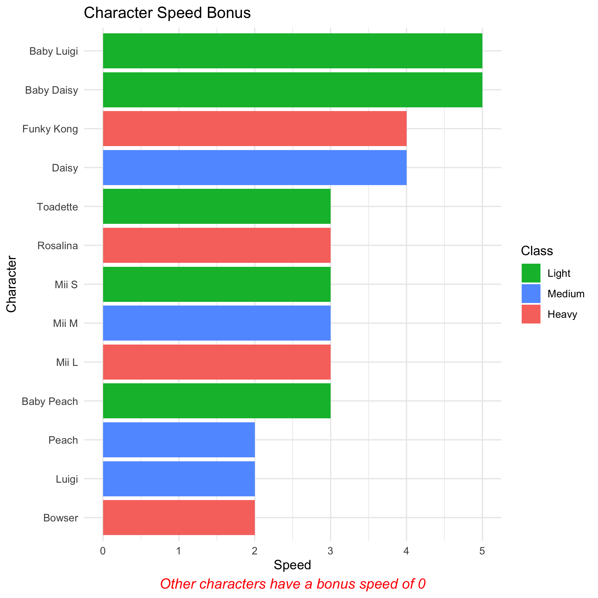

USAGE
-----
You'll need Docker and the ability to run Docker as your current user.

You'll need to build the container:

    > docker build . -t mariokart_env

This Docker container is based on rocker/verse. To run rstudio server:

    > docker run -v `pwd`:/home/rstudio -p 8787:8787 -e PASSWORD=mypass -t mariokart_env
      
Then connect to the machine on port 8787.

#### Make
Use Makefile as recipe book for building artifacts found in derived directories. 

##### Example:
In local project directory, to build artifact named Raleigh.Clean.csv:

    > make derived_data/Example.csv
    
Use artifacts before colon as make targets. Dependencies are listed after colon. 

***

Introduction
------------

## Authors:
Lindsey Braxton \
Matt Johnson

## Data
Data is taken from Kaggle and can be found [here](https://www.kaggle.com/barelydedicated/mariokart8)

Data will need to be in source_data Directory with the follow names: \
bodies.csv \
characters.csv \
gliders.csv \
tires.csv

## Content
This project contains R code for Mario Kart 8 character analysis. 

***

Preliminary Plots
-----------------

